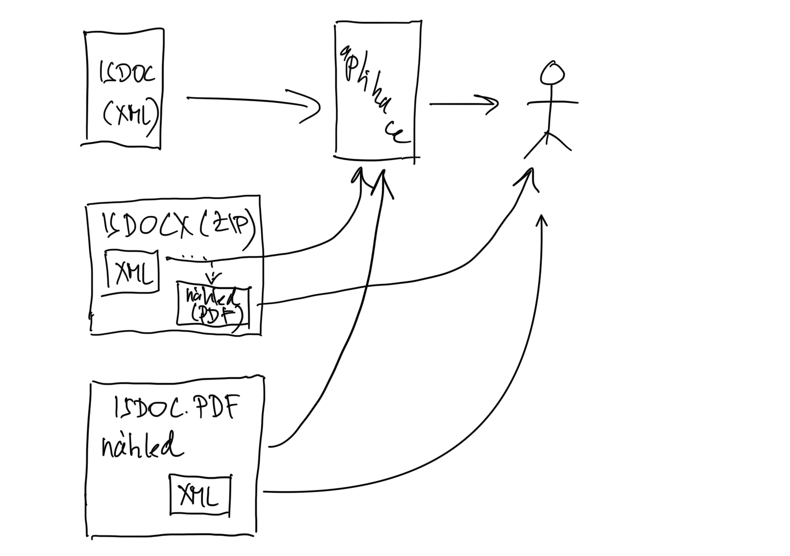

= Novinky v ISDOC 6.0.2
Jirka Kosek <jirka@kosek.cz>
2022-09-26
:revealjs_theme: white
:revealjs_history: true
:revealjsdir: https://kosek.cz/2019/reveal.js

Pracovní skupina RVIS pro elektronickou fakturaci

Praha, 26. září 2022

== Novinky v ISDOC 6.0.2

* Přidána nová reprezentace dokumentu ISDOC.PDF, kdy je dokument ISDOC vložen do formátu PDF/A-3
* Vylepšení popisu některých elementů
* Schéma kontroluje unikátnost identifikátoru řádky dokladu
* Upřesnění detailů výpočtu časového razítka

== Reprezentace dokumentu

* Předchozí verze ISDOC podporovaly dva různé způsoby reprezentace dokumentu
** Samostatný XML dokument (typicky přípona `.isdoc`)
** Archiv, kdy jsou v archivu ZIP kromě samotné faktury v XML i další související dokumenty (typicky přípona `.isdocx`)

== Reprezentace ISDOC.PDF

* ISDOC 6.0.2 přidává novou reprezentaci ISDOC.PDF
** Do dokumentu PDF s vizuální podobou faktury je vložen XML dokument (typicky přípona `.isdoc.pdf`)

== !

== ISDOC.PDF

* běžný dokument PDF, který lze zobrazit v prohlížečí PDF (Acrobat Reader, webový prohlížeč, ...)
* navíc musí splňovat další podmínky
** používá se verze PDF/A-3a
** do PDF je vložena příloha pojmenovaná `invoice.isdoc`

== Vyvtváření ISDOC.PDF

1. vytvoříme dokument ISDOC (XML) běžným způsobem
2. vytvoříme tiskovou verzi faktury (PDF) běžným způsobem
3. pomocí vhodného nástroje PDF a ISDOC (XML) složíme do jednoho souboru PDF

== Odkazy

* Příklady a nástroje pro vytváření ISDOC.PDF
** https://github.com/isdoc/isdoc.pdf
* Standard ISDOC 6.0.2
** https://isdoc.cz/6.0.2/
* Další informace o formátu ISDOC
** https://www.mvcr.cz/isdoc/
* Hlášení chyb ve standardu
** https://github.com/isdoc/schema/issues
